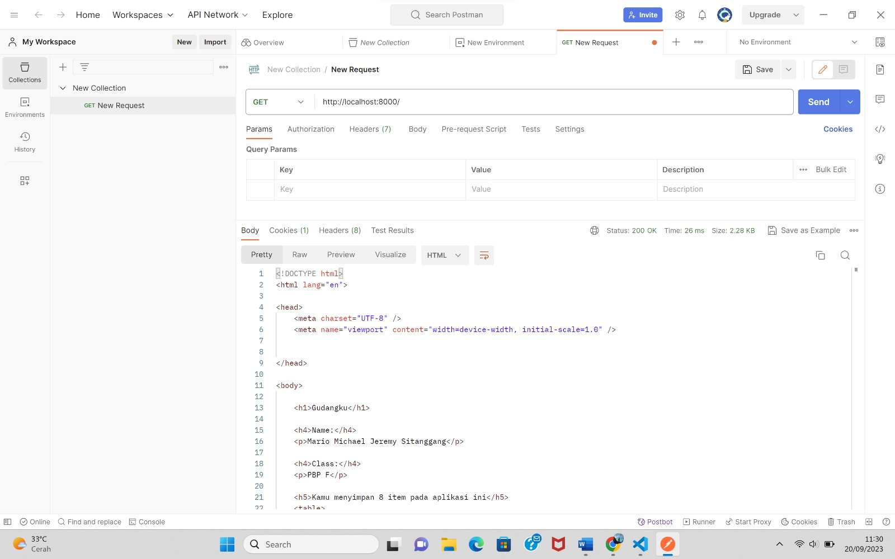
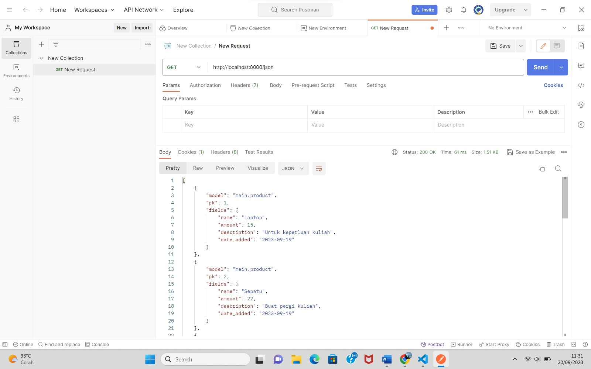
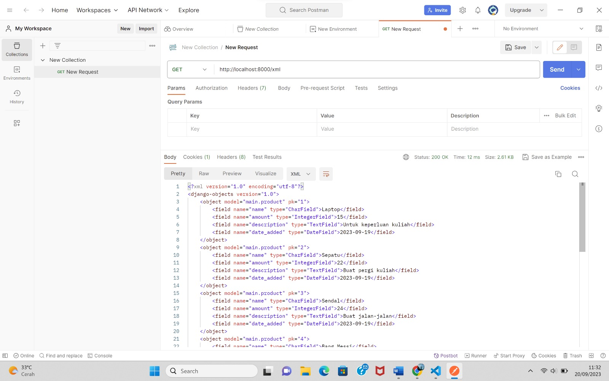
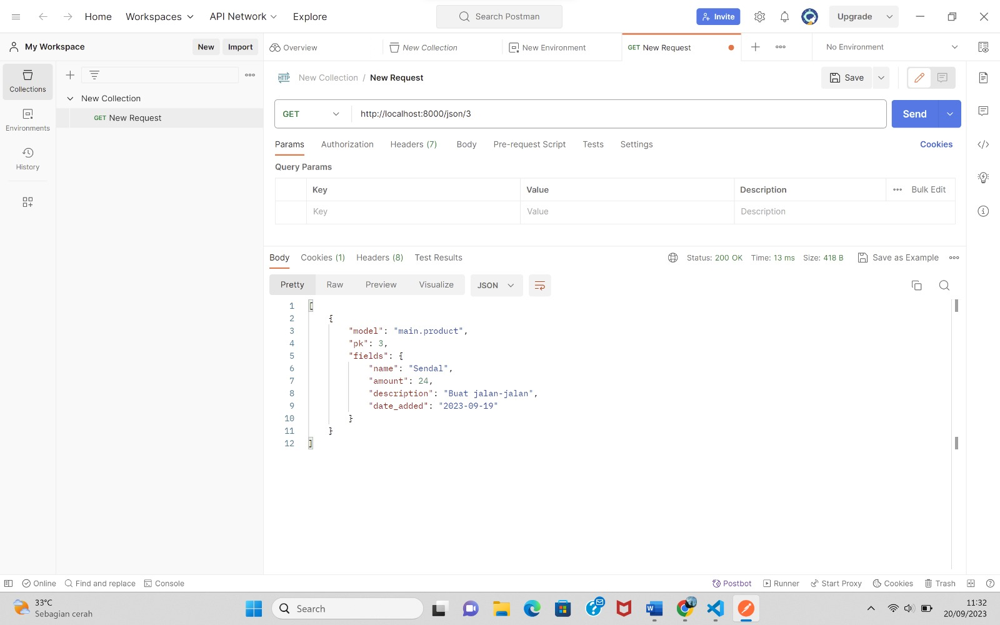
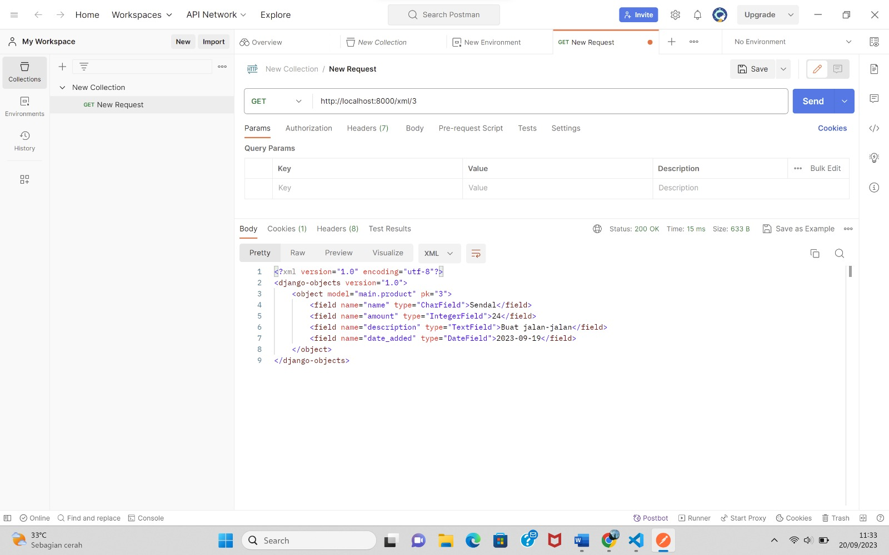
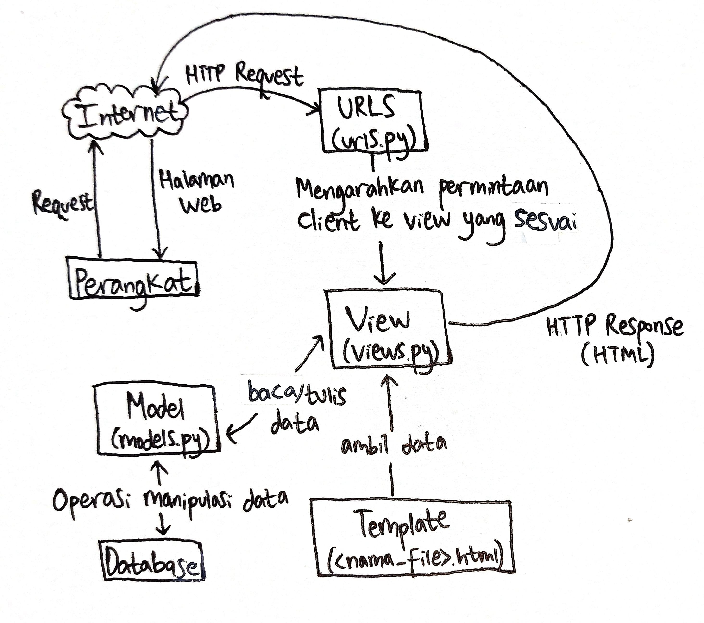

Tautan Website: mario-michael-tugas.pbp.cs.ui.ac.id  
 
========== TUGAS 6 ==========  

1. Jelaskan perbedaan antara asynchronous programming dengan synchronous programming!  
Perbedaan keduanya adalah pada synchronous programming, eksekusi tugas dilakukan secara berurutan dan satu per satu. Suatu tugas harus menunggu sampai eksekusi tugas sebelumnya selesai jika ingin dijalankan. Maka dari itu suatu tugas yang membutuhkan waktu lama untuk dikerjakan akan menyebabkan program menjadi lambat dalam synchronous programming karena tugas lain belum bisa dieksekusi.   
Berbanding terbalik dengan synchronous programming, asynchronous programming adalah paradigma programming yang memungkinkan beberapa tugas dieksekusi secara bersamaan, sehingga suatu tugas tidak harus menunggu tugas lain selesai jika ingin dieksekusi. Hal ini akan meningkatkan kinerja dan tingkat responsivitas website.  
 

2. Dalam penerapan JavaScript dan AJAX, terdapat penerapan paradigma event-driven programming. Jelaskan maksud dari paradigma tersebut dan sebutkan salah satu contoh penerapannya pada tugas ini!  
Paradigma event-driven programming adalah paradigma pemrograman dimana alur program ditentukan oleh event/peristiwa seperti tindakan user dalam menggunakan mouse, keyboard (mengetik keyboard), atau touchpad.  
Contoh penerapan paradigma tersebut dalam tugas ini adalah ketika user mengklik tombol “Add Item by AJAX”, akan muncul sebuah form yang siap menerima input dari item yang akan dimasukkan oleh user.  
 

3. Jelaskan penerapan asynchronous programming pada AJAX!  
 
Penerapan asynchronous programming pada AJAX adalah ketika terjadi sebuah event, misalnya seperti GET dan POST pada HTTP, permintaan akan dikirim melalui AJAX dan AJAX akan meneruskan ke server, sedangkan user akan tetap bisa melakukan permintaan lain di waktu yang sama ketika AJAX melanjutkan permintaan tersebut ke server. Setelah itu user tinggal menunggu respon dari server melalui AJAX sambil melakukan event-event lainnya.  

4. Pada PBP kali ini, penerapan AJAX dilakukan dengan menggunakan Fetch API daripada library jQuery. Bandingkanlah kedua teknologi tersebut dan tuliskan pendapat kamu teknologi manakah yang lebih baik untuk digunakan!  
Fetch API adalah API yang memungkinkan untuk membuat HTTP Request pada JavaScript. API ini menggunakan konsep promise untuk mengelola response dari server. Kelebihan menggunakan Fetch API adalah dia merupakan standar web modern yang dipakai saat ini dan karena merupakan bagian dari JavaScript, Fetch API tidak membutuhkan library dari luar.  
Sedangkan jQuery adalah teknologu yang dirancang untuk penggunaan yang lebih kompleks karena terdapat banyak plugin. Kelebihannya adalah dapat compatible ke lebih banyak browser ketimbang AJAX.  
Menurut saya, teknologi yang lebih baik digunakan adalah Fetch API jika proyek yang dikerjakan masih tahap kecil karena mengikuti standar modern dan lebih banyak fitur JavaScript yang bisa diimplementasikan. Namun  jika proyeknya besar, lebih baik menggunakan jQuery karena sudah banyak plugin yang tersedia untuk mengatasi hal tersebut.  
 

5. Jelaskan bagaimana cara kamu mengimplementasikan checklist di atas secara step-by-step (bukan hanya sekadar mengikuti tutorial)!  
Pertama saya masuk ke main.html yang ada pada folder templates, di sana saya mengubah implementasi card agar mengambil data menggunakan AJAX, dengan cara mengubah function refeshProducts pada bagian dalam script.  
Setelah itu saya menghapus tabel untuk menampilkan objek yang telah saya buat setelahnya.  
Ketiga, saya menambahkan function addProduct di bawah function yang baru saya ubah tersebut. Function ini akan mengurus masalah add product menggunakan AJAX.  
Saya juga mengubah views.py dengan menambahkan function yang akan menghandle add item dari AJAX. Setelah itu saya menambahkan path yang dibutuhkan pada urls.py  
Setelah itu saya melakukan perintah collectstatic untuk mengumpulkan file static yang diminta.  
Terakhir, saya melakukan konfigurasi untuk mendeploy ke PaaS Fasilkom UI.  

========== TUGAS 5 ==========  
1 - Jelaskan manfaat dari setiap element selector dan kapan waktu yang tepat untuk menggunakannya.  
 
a.	Selector Element  
Manfaat selector ini adalah untuk memungkinkan pengubahan properti untuk semua elemen yang memiliki tag HTML atau jenis yang sama.  
Selector ini tepat digunakan ketika kita ingin menggunakan gaya yang sama ke semua elemen dengan jenis tertentu, seperti mengatur gaya dasar semua paragraf atau gambar dalam aplikasi web kita.  
b.	Selector ID  
Manfaat selector ini adalah untuk memilih elemen dengan ID tertentu yang bersifat unik dalam satu halaman web.  
Selector ini tepat digunakan ketika ingin mengatur gaya untuk elemen tertentu yang bersifat unik dan tidak berlaku untuk semua elemen, misalnya mengatur font untuk header.  
c.	Selector Class 
Manfaat selector ini adalah untuk memungkinkan pengelompokkan elemen dengan karakteristik yang sama seperti berdasarkan class tertentu yang diberikan pada elemen.  
Selector ini tepat digunakan untuk menerapkan gaya yang sama pada beberapa elemen dari class yang sama seperti tombol, form input, dan lain-lain.  
d.	Selector Universal  
Manfaat selector ini adalah untuk menyeleksi semua elemen HTML di sebuah halaman web.  
Selector ini tepat digunakan untuk mengatur semua elemen secara menyeluruh dalam satu halaman web atau digunakan untuk mereset CSS.  
e.	Selector Grouping  
Manfaat selector ini adalah untuk menyeleksi semua elemen HTML dengan definisi style yang sama.  
Selector ini tepat digunakan ketika kita ingin menerapkan gaya yang sama pada beberapa elemen yang berbeda sehingga bisa mengelompokkan beberapa selector jadi satu dan mengurangi jumlah kode yang ditulis.  
 

2 - Jelaskan HTML5 Tag yang kamu ketahui.  
 
Ada beberapa HTML5 Tag yang saya ketahui, diantaranya:  
Catatan: tag ditulis di dalam kurung "<>" dan tag untuk comment tidak memiliki spasi antarkarakter, spasi di sini ditulis agar bentuk tag comment bisa terlihat  
-	< !--...--> berfungsi untuk menyatakan comment/komentar 
-	br berfungsi untuk menyisipkan satu baris baru 
-	button berfungsi untuk membuat tombol tekan 
-	col berfungsi untuk menentukan atribut  kolom pada tabel 
-	div berfungsi untuk membuat bagian/section baru dalam dokumen 
-	b berfungsi untuk menampilkan huruf tebal 
-	i berfungsi untuk menampilkan huruf miring/italic 
-	form berfungsi untuk menentukan sebuah form 
-	head berfungsi untuk memberikan informasi tentang dokumen 
-	h1 - h6 berfungsi untuk memberikan keterangan jenis header, semakin kecil angkanya maka ukuran hurufnya akan semakin besar 
-	html berfungsi untuk menyatakan bahwa dokumen tersebut adalah dokumen HTML 
-	img berfungsi untuk memasukkan gambar ke halaman web 
-	link berfungsi untuk memberikan keterangan referensi sumber 
-	p berfungsi untuk memberikan keterangan bahwa teks tersebut harus ditampilkan sebagai paragraf 
-	style berfungsi untuk memberikan "style" pada suatu "element" seperti men-center-kan elemen  
-	table untuk menyatakan sebuah tabel  
-	td untuk menyatakan sel pada tabel  

3 - Jelaskan perbedaan antara margin dan padding.  
 
Perbedaan antara margin dan padding terletak pada area yang mereka kosongkan. Margin mengosongkan area di sekitar border dan bersifat transparan, sedangkan padding mengosongkan area di sekitar konten (isi website) yang juga bersifat transparan. Jadi konten dengan border akan dibatasi oleh padding sedangkan border dengan area di luarnya lagi akan dibatasi oleh margin. Perbedaan lainnya adalah margin tidak memiliki pengaruh terhadap warna atau background elemen sedangkan padding akan mempengaruhi tata letak konten di dalam elemen.  
 

4 - Jelaskan perbedaan antara framework CSS Tailwind dan Bootstrap. Kapan sebaiknya kita menggunakan Bootstrap daripada Tailwind, dan sebaliknya?  
 
Perbedaan antara kedua framework CSS yaitu Tailwind dan Bootstrap yang pertama adalah Tailwind membangun tampilan dengan menggabungkan kelas-kelas utilitas yang telah didefinisikan sebelumnya, sedangkan Bootstrap menggunakan gaya dan komponen yang telah didefinisikan yang juga memiliki tempilan yang sudah jadi dan dapat digunakan secara langsung.  
Perbedaan kedua adalah Tailwind memiliki file CSS yang sedikit lebih kecil dari Bootstrap dan hanya akan memuat kelas-kelas utilitas yang ada, sedangkan Bootstrap memiliki file CSS yang lebih besar karena memuat banyak komponen yang telah didefinisikan.  
Perbedaan ketiga adalah Tailwind memberikan fleksibilitas dan adaptabilitas tinggi terhadap proyek sedangkan Bootstrap memberikan tampilan yang lebih konsisten di seluruh proyek karena Ia menggunakan komponen yang telah didefinisikan sebelumnya.  
Perbedaan terakhir adalah Tailwind memerlukan pemahaman mendalam terhadap kelas-kelas utilitas dan bagaimana menggabungkannya untuk menghasilkan target yang ingin dicapai sehingga pembelajarannya akan lebih sulit, sedangkan Bootstrap memiliki komponen yang telah didefinisikan sehingga akan lebih cepat untuk dipelajari dan lebih ramah pemula.  
Sebaiknya kita menggunakan Bootstrap daripada Tailwind ketika kita ingin memiliki proses pengembangan yang lebih cepat karena komponen pada Bootstrap sudah didefinisikan sehingga siap pakai tanpa harus menulis kode CSS dari awal, ini akan mempersingkat waktu pengerjaan website, meskipun desainnya cenderung akan bersifat konsisten dan tidak sefleksibel Tailwind. Sedangkan Tailwind sebaiknya digunakan ketimbang Bootstrap ketika kita ingin memiliki fleksibilitas dan otoritas sangat besar terhadap desain dan tata letak elemen dalam aplikasi web yang sedang dibangun sehingga dapat menghasilkan desain yang unik dan murni. Jadi pada dasarnya pemilihan keduanya berdasarkan waktu pengerjaan proyek dan tingkat fleksibilitas desain web yang diharapkan.  
 

5 - Jelaskan bagaimana cara kamu mengimplementasikan checklist di atas secara step-by-step (bukan hanya sekadar mengikuti tutorial).  
 
Checklist di atas sebenarnya hanya terdiri dari satu poin yaitu kustomisasi  desain template HTML yang telah dibuat di tugas 4 dengan menggunakan CSS atau frameworknya, namun checklist ini dibagi menjadi dua ketentuan yaitu kustomisasi halaman login, register, dan tambah inventori, serta kustomisasi halaman daftar inventori menjadi lebih berwarna atau menggunakan desain lain seperti penggunaan Card dengan Bootstrap.  
 
Untuk kustomisasi halaman login, register, dan tambah inventori, pertama saya menambahkan tag meta name = viewport agar halaman web saya dapat menyesuaikan ukuran dan perilaku perangkat yang saya gunakan. Setelah itu saya menambahkan Bootstrap CSS dan JavaScript dengan menambahkan link di bagian paling bawah section head. Sekarang saya siap menggunakan keduanya.  
 
Kustomisasi yang pertama saya lakukan adalah menambahkan navbar pada aplikasi menggunakan Bootstrap dimana referensinya saya dapatkan dari dokumentasi Bootstrap. Saya menggunakan navbar yang menampilkan username di bagian kiri atas dan kolom search serta tombol Logout di kanan atas, namun untuk saat ini kolom search hanya sebagai penghias karena belum bisa difungsikan. Implementasi ini saya lakukan dengan membuat tag class berupa navbar bg-body-tertiary lalu sejumlah tag lainnya dimana saya juga menggunakan style untuk button dengan menambahkan class “btn btn-outline-success”.  
 
Setelah menambahkan navbar, kustomisasi lain yang saya lakukan adalah menambahkan fitur edit inventori pada aplikasi. Pertama saya membuat fungsi edit_product pada file views.py di main yang akan menerima input form dan melakukan post ulang dari input tersebut. Tidak lupa membuat berkas HTML dengan nama yang sama pada direktori templates di main untuk menerima input perubahan inventori. Setelah itu saya mengimport function edit_product yang telah saya buat sebelumnya di urls.py dan menambahkan pathnya ke urlpatterns pada file yang sama. Setelah itu saya menambahkan kode untuk menampilkan tombol edit pada setiap baris objek inventori.  
 
Saya juga menambah fitur untuk menghapus data produk yang langkahnya mirip dengan pembuatan fitur edit produk. Pertama buat fungsi delete_product di views.py yang ada pada folder main. Setelah itu import fungsi tersebut di urls.py dan tambahkan pathnya ke urlpatterns agar bisa diakses. Setelah itu tambahkan kode HTML untuk membuat tombol yang akan menjalankan fungsi delete_product tersebut. Saya menambahkan class pada button Edit dan Delete agar memiliki tampilan yang lebih menarik dengan cara mengcopy salah satu class dari button yang lain dan memasukkannya setelah tag button.  
 
Untuk halaman login sekarang sudah ada perubahan font, bentuk kotak input, dan model tombol, sedangkan halaman registrasi dan tambah inventori sudah ada perubahan font dan bentuk kotak input. Untuk halaman utama sendiri sudah banyak perubahan seperti yang sudah dijelaskan sebelumnya.  
 
Yang kedua, untuk kustomisasi halaman daftar inventori, saya menggunakan approach tambahan yaitu Card namun tetap mempertahankan tabel yang asli. Saya mendapat referensi dari dokumentasi Card Bootstrap v5.0 dimana saya memilih div class card-group dengan informasi dalam Card berupa judul, deskripsi, waktu update terakhir, dan jumlah item. Di Card tersebut saya paling banyak menggunakan tag div, p, dan h1-6 yang fungsinya sudah dijelaskan pada nomor sebelumnya.  
 
Itulah langkah-langkah saya dalam melakukan kustomisasi untuk webstite dari Tugas 4.

========== TUGAS 4 ==========
1. Apa itu Django UserCreationForm, dan jelaskan apa kelebihan dan kekurangannya?  

Django UserCreationForm adalah impor formulir bawaan pada Django yang memudahkan pembuatan formulir pendaftaran pengguna dalam aplikasi web. Formulir ini digunakan untuk membuat pengguna baru yang bisa menggunakan aplikasi web yang telah penulis kode buat. Formulir ini memiliki tiga fields yaitu username, password1, dan password2 (untuk konfirmasi password). Denagn formulir ini, pengguna baru dapat mendaftar dengan mudah di situs web penulis kode tanpa harus menulis kode dari awal. Kelebihan formulir ini adalah mudah mudah digunakan karena penulis kode hanya perlu menggunakan fungsi bawaan Django, selain itu formulir ini sudah melakukan validasi otomatis (seperti validasi password) sehingga penulis kode tidak perlu memikirkan masalah validasi input user, formulir ini juga secara otomatis terkait dengan model pengguna bawaan Django, sehingga penulis kode tidak perlu lagi membuat model sendiri. Django juga sudah memiliki proteksi built-in untuk kebanyakan serangan yang bertipe Cross Site Request Forgery (CSFR) yang hanya perlu diaktivasi penulis kode di settings.py. Terakhir, penulis kode dapat dengan mudah melakukan perubahan/kustomisasi field yang akan digunakan dalam aplikasi website penulis kode. Meskipun memiliki banyak kelebihan, formulir ini juga memiliki kekurangan, misalnya tampilan yang diberikan adalah tampilan standar, sehingga penulis kode harus menyesuaikan sesuai desain websitenya. Kekurangan lainnya adalah jika field yang penulis kode butuhkan lumayan banyak perubahan dari template awal, mungkin penulis kode harus membuat formulir kustom sepenuhnya, sehingga template menjadi kurang terpakai. Formulir ini juga tidak mendukung pilihan pendaftaran akun menggunakan sosial media seperti akun Gmail, Facebook, dan lain-lain, sehingga penulis kode harus menambahkannya secara terpisah jika ingin menggunakan fitur ini. Terakhir, meskipun formulir ini memiliki proteksi built-in untuk hamper semua serangan CSRF, formulir ini tetap tidak memiliki proteksi untuk semua jenis serangan sehingga ada beberapa jenis yang harus diatasi secara manual.  
 

2. Apa perbedaan antara autentikasi dan otorisasi dalam konteks Django, dan mengapa keduanya penting?  

Perbedaan antara autentikasi dan otorisasi dalam konteks Django adalah autentikasi merupakan proses memverifikasi (memastikan kebenaran) siapa yang sedang login (identitas pengguna) untuk memastikan bahwa pengguna memiliki akses ke aplikasi web tersebut, sedangkan otorisasi adalah proses memverifikasi bahwa pengguna yang sedang login tersebut memiliki akses ke hal/sistem tertentu. Dalam konteks Django, autentikasi adalah sistem bawaan yang sudah disediakan Django yang memungkinkan pengguna untuk melakukan register, login, dan logout, termasuk adanya verifikasi username dan password. Sedangkan otorisasi dalam konteks Django adalah sistem bawaan yang disediakan oleh Django yang menggunakan konsep “group” dan “permission” dimana pengembang web dapat menentikan siapa yang dapat melakukan apa di aplikasi web tersebut. Autentikasi penting untuk memastikan bahwa hanya mereka yang mempunyai akses atau terdaftar yang bisa mengakses data atau berinteraksi langsung dengan sistem di dalam aplikasi web, sehingga keamanan sistem lebih terjaga karena tidak sembarang orang dapat melakukan tindakan dalam aplikasi web tersebut dengan bebas. Sedangkan otorisasi penting untuk mengendalikan akses ke data ataupun fitur tertentu dalam aplikasi web, sehingga memastikan pengguna menggunakan aplikasi web sesuai hak dan batasannya masing-masing agar terhindar dari penyalahgunaan dan memastikan keamanan informasi. Secara garis besar, keduanya penting untuk menjaga data dan informasi agar hanya dapat diakses oleh orang-orang tertentu baik yang sudah terdaftar maupun tidak pada aplikasi web, maupun bagi orang dengan peran yang berbeda-beda dalam kumpulan orang yang sudah terdaftar pada aplikasi web.  
 

3. Apa itu cookies dalam konteks aplikasi web, dan bagaimana Django menggunakan cookies untuk mengelola data sesi pengguna?  

Dalam konteks aplikasi web, cookies adalah sejumlah kecil informasi yang dikirim oleh web server ke browser dan kemudian dikirimkan kembali oleh browser untuk kebutuhan request halaman berikutnya. Cookies digunakan untuk melakukan autentikasi, mempertahankan preferensi pengguna, dan men-track pengguna. Data pada cookie terdiri dari sebuah nama atau pasangan nilai seperti dictionary yang dikirim di header HTTP GET atau POST request klien. Cookies tidak dapat menghapus atau bahkan membaca informasi dari komputer pengguna dan biasanya tidak mengandung informasi personal. Django menggunakan cookies untuk mengelola data sesi pengguna dengan menyimpan datanya pada memori browser. Pertama, ketika ada request dari pengguna, browser akan mengirim sessionid cookie pada server. Cookie ini berisi ID sesi yang unik. Data sesi ini kemudian disimpan di memori browser. Setelah itu ID sesi yang disimpan di browser akan digunakan untuk menghubungkan pengguna dengan data mereka yang disimpan. Setiap kali pengguna mengakses halaman web tersebut, Django akan mengamcil data sesi yang sesuai dari penyimpanan sesi menggunakan ID yang sebelumnya telah disimpan. Jika ada perubahan data sesi, Django akan mengambil data terbaru dan menyimpannya di penyimpanan sesi. Terakhir, ketika pengguna keluar, sesi pengguna berakhir, atau browser ditutup, data sesi beserta cookiesnya akan dihapus dari perangkat pengguna. Cookie tidak bisa digunakan untuk melacak informasi jangka panjang. Selain itu cookie juga aman karena hanya dapat diakses oleh browser.  
 

4. Apakah penggunaan cookies aman secara default dalam pengembangan web, atau apakah ada risiko potensial yang harus diwaspadai?  

Secara default, penggunaan cookies dalam pengembangan web bersifat aman. Hal ini karena data ini hanya bisa diakses oleh browser dan disimpan secara sementara di memori browser pengguna karena cookie akan terhapus setelah sesi habis atau browser ditutup. Hal ini membuat cookie tidak bisa digunakan untuk melacak informasi jangka panjang. Selain itu, cookie umumnya tidak menyimpan informasi pribadi yang krusial, namun lebih ke preferensi dari suatu pengguna yang sudah terdaftar. Cookie juga tidak bisa menghapus atau bahkan membaca informasi dari komputer pengguna sehingga data-data pribadi yang bersifat lokal tidak akan dikirim melalui browser meskipun untuk tujuan mengenali preferensi. Cookie juga hanya menyimpan data, bukan menyimpan kode yang bisa menyerang sistem komputer. Meskipun begitu, jika data pada cookie jatuh pada orang yang salah, mereka bisa sangat berbahaya karena penyerang bisa mengakses sesi pencarian dan mencuri informasi personal, atau bahkan menyalahgunakan data cookie untuk tujuan yang lain. Resiko potensial yang harus diwaspadai adalah jangan menggunakan Wi-Fi umum secara sembarangan ketika pengguna menyimpan data-data penting pada akun yang sama. Meskipun cookie tidak menyimpannya, penyerang biasanya tetap mencoba menyerang melalui Wi-Fi umum yang digunakan oleh sembarangan orang untuk bisa masuk ke sesi pencarian mereka. Sehingga berhati-hatilah ketika sedang menggunakan internet umum yang bisa diakses oleh siapapun.  
 

5. Jelaskan bagaimana cara kamu mengimplementasikan checklist di atas secara step-by-step (bukan hanya sekadar mengikuti tutorial)  

Pertama, saya mengimplementasi fungsi registrasi, login, dan logout, serta merestriksi pengguna agar harus login untuk bisa mengakses aplikasi website yang sedang dibangun. Untuk melakukan itu, seperti aktifkan virtual environment terlebih dahulu, setelah itu buat fungsi register pada views.py yang menerima parameter request yang ada di subdirektori main yang berfungsi untuk menghasilkan formulir registrasi secara otomatis serta menghasilkan akun pengguna setelah data disubmit dari form. Import fungsi yang dibutuhkan, seperti UserCreationForm untuk membuat form otomatis dan fungsi-fungsi lain. Setelah itu saya membuat berkas HTML baru dengan nama register.html di folder template pada direktori main. Berkas ini akan menangani proses login dari pengguna. Setelah itu saya mengimpor fungsi register yang sudah saya buat ke urls.py pada subdirektori main. Saya juga menambahkan path url register ke urlpatterns agar fungsi register nantinya bisa diakses.  
Untuk membuat fungsi login, pertama-tama saya membuat fungsi login_user yang menerima parameter request pada views.py di subdirektori main. Fungsi ini berfungsi untuk mengautentikasi pengguna yang ingin login. Impor juga fungsi yang sesuai dari modul yang sudah ada untuk menjalankan fungsi ini, misalnya import authenticate dan login untuk melakukan autentikasi dan login jika autentikasi berhasil. Setelah itu buat berkas HTML baru dengan nama login.html pada folder templates di direktori main yang berisi kode untuk menangani pengguna yang ingin  login. Setelah itu seperti biasa saya mengimpor fungsi yang sudah saya buat seperti login_user dan menambahkan path login pada urlpatterns.  
Untuk membuat fungsi logout, saya mengulangi langkah seperti fungsi login yaitu membuat fungsi untuk logout dan menambah impor yang sesuai, lalu menambahkan hyperlink tag untuk Logout pada main.html. Setelah itu impor fungsi logout_user dan tambahkan di urlpatterns pada urls.py.  
Untuk merestriksi halaman, pertama saya impor modul Django yang dibutuhkan yaitu login_required dan menambahkan tag @login_required(login_url='/login') di atas fungsi show_main dengan tujuan halaman main hanya dapat diakses oleh pengguna yang sudah terauntentikasi. .  
Setelah menyelesaikan registrasi, login, dan logout, saya menghubungkan Item dengan User dengan cara mengimpor User dari django.contrib.auth.models lalu menambahkan “user = models.ForeignKey(User, on_delete=models.CASCADE)” yang berfungsi untuk menghubungkan satu produk dengan satu user. Selanjutnya saya mengubah potongan kode pada fungsi create_product di views.py untuk menandakan bahwa objek X dimiliki oleh pengguna yang sedang terotorisasi. Setelah itu saya melakukan migrasi dari model. Karena ada error, saya memilih opsi 1 lalu mengetik angka 1 untuk menset default value pada field).  
Setelah itu, saya mencoba untuk menampilkan detail informasi pengguna yang sedang login seperti username dan last login dengan cara mengubah value dari variable name di show_main pada views.py dengan “request.user.username” untuk menampilkan informasi pengguna yang sedang login, lalu saya melakukan migrasi seperti sebelumnya. Untuk cookies, pertama saya memodifikasi kode pada fungsi login_iser untuk menambahkan cookie bernama last_login, saya juga mengimpor semua fungsi yang dibutuhkan. Setelah itu pada fungsi show_main di views.py, saya menambahkan value ‘last_login’ yang diisi dengan “request.COOKIES[‘last_login’]” yang berfungsi untuk menambahkan informasi cookie waktu terakhir login pada saat halaman web ditampilkan. Setelah itu saya mengubah fungsi logout_user dengan tambahan delete_cookie untuk menghapus cookie last_login saat pengguna melakukan logout. Setelah itu tinggal menambahkan tulisan untuk menampilkan informasi last login pada main.html.  
Setelah semuanya selesai, saya lakukan “python manage.py runserver” lalu menjalankan program pada Localhost. Di sana saya membuat dua akun dengan masing-masing 3 item berbeda. Setelah saya coba, program saya bekerja sebagaimanamestinya. Maka artinya program saya sudah selesai untuk tugas kali ini.  
 
========== TUGAS 3 ==========
1. Apa perbedaan antara form POST dan form GET dalam Django?  
POST dan GET adalah contoh HTTP request method, keduanya merupakan contoh dari beberapa HTTP request method yang paling sering digunakan. Secara umum, perbedaan keduanya adalah request GET digunakan untuk membaca atau mengambil data dari web server. GET akan mengembalikan kode status HTTP 200 (OK) jika data berhasil diambil dari server. Sedangkan request POST digunakan untuk mengirim data (file, form data, dan lain-lain) ke server. Jika berhasil pembuatannya, POST akan mengembalikan kode status HTTP 201. Perbedaan lainnya adalah data yang dikirimkan dengan metode POST tidak ditampilkan secara langsung dalam URL, sehingga data menjadi lebih aman, sedangkan pada metode GET, data yang dikirim muncul dalam URL, sehingga dapat dilihat oleh semua orang. Perbedaan selanjutnya adalah pada metode POST, terdapat batasan ukuran data yang dapat dikirim, sedangkan pada metode GET, tidak ada batasan ukuran data.  Perbedaan lain adalah POST digunakan untuk menjalankan request yang bisa mengubah keadaan sistem (misalnya mengubah database), sedangkan GET digunakan untuk request yang tidak mengubah keadaan sistem. Perbedaan lain adalah pada metode GET, data bisa dicache sehingga bisa meningkatkan performa website, sedangkan pada POST tidak bisa dilakukan hal tersebut.  
 
2. Apa perbedaan utama antara XML, JSON, dan HTML dalam konteks pengiriman data?  
Perbedaan utama antara XML, JSON, dan HTML dalam konteks pengiriman data adalah XML biasa digunakan untuk mengirim data yang sangat terstruktur dan memiliki hierarki yang kompleks, misalnya konfigurasi aplikasi dan data yang memerlukan validasi yang ketat. Sedangkan JSON lebih umum digunakan untuk mengirim data yang lebih ringkas dan mudah diproses oleh aplikasi web modern karena hanya terdiri dari pasangan key dan value, misalnya data yang akan ditampilkan di halaman web dan data konfigurasi. Sedangkan HTML sebagian besar digunakan untuk menggambarkan tampilan dan struktur halaman web, jadi secara tampilan tentu lebih jelas dan lebih mudah dipahami orang awam, dibanding dengan tampilan JSON dan XML. Jenis data yang biasa dikirim dengan HTML adalah elemen yang akan ditampilkan di aplikasi web seperti teks, gambar, link, form (seperti pada Tutorial 2 PBP), dan elemen-elemen lainnya.  
 
3. Mengapa JSON sering digunakan dalam pertukaran data antara aplikasi web modern?  
JSON sering digunakan dalam pertukaran data antara aplikasi web modern karena teksnya ringan dan sangat mudah dibaca dan dimengerti manusia, membutuhkan lebih sedikit proses coding, dan dapat memproses data dengan lebih cepat dari XML karena struktur datanya hanya berupa pasangan key dan value, tidak sekompleks XML. Selain itu, JSON juga bersifat language-agnostic atau tidak terikat bahasa pemrograman. Ini menyebabkan JSON lebih sering digunakan karena semua jenis programmer lebih mudah mengimplementasi JSON. JSON juga dapat digunakan untuk mengolah berbagai tipe data sehingga lebih serbaguna untuk merepresentasikan berbagai jenis informasi. Kelebihan lainnya adalah JSON memiliki ukuran data yang relatif lebih kecil dibanding format lain seperti XML, sehingga proses pertukaran data akan terjadi lebih cepat. Dalam JSON juga sudah terdapat banyak tools dan library untuk melakukan parsing dan serializing data  dalam berbagai bahasa pemrograman sehingga ini memperkuat keunggulan JSON yang dapat digunakan lintas platform. Terakhir, karena JSON merupakan turunan dari Object JavaScript dimana JavaScript sendiri umumnya telah digunakan untuk mengembangkan aplikasi web, JSON juga didukung oleh JavaScript sehingga memungkinkan komunikasi langsung antara browser dan server menggunakan JSON.  
 
4. Jelaskan bagaimana cara kamu mengimplementasikan checklist di atas secara step-by-step (bukan hanya sekadar mengikuti tutorial).  
Langkah pertama adalah langkah opsional, namun saya melakukannya agar Localhost menjadi lebih mudah dilihat. Langkah ini adalah mengatur routing dari “main/” ke “/”. Pertama aktifkan virtual environment terlebih dahulu. Setelah itu ubah path “main/” menjadi “’’” pada urlpatterns yang terdapat di urls.py pada folder gudangku. Routing berhasil diubah.  
Setelah mengubah routing, saatnya membuat input form untuk menambahkan objek model pada app yang telah dibuat. Namun sebelum membuat input form, buatlah skeleton sebagai kerangka views yang nantinya akan dikembangkan. Ini bertujuan agar ada konsistensi dalam desain situs web dan memperkecil kemungkinan adanya pengulangan kode.  
Di langkah kedua ini, pertama saya membuat folder templates pada root folder dan mengisinya dengan file base.html. File ini akan saya gunakan sebagai kerangka dasar halaman web. File ini diisi dengan kerangka web seperti pada umumnya yang terdiri dari head dan body. Setelah itu isi value dari key “DIRS” dengan “[BASE_DIR / ‘templates]’ pada dictionary TEMPLATES di settings.py di subdirektori gudangku. Setelah itu ubah kode pada file main.html pada subdirektori templates dengan mengextend dari base.html.  
Setelah membuat kerangka web, sekarang form input data sudah siap dibuat. Pertama buat file baru bernama forms.py pada direktori main untuk membuat struktur form yang bisa menerima data produk baru. File tersebut berisi class ProductForm yang merupakan turunan dari ModelForm, di dalamnya, buat class Meta yang digunakan untuk menunjukkan model dan fields yang digunakan untuk form. Setelah itu pindah ke file views.py yang ada pada folder main dan implementasikan fungsi create_product yang menerima parameter request, fungsi ini bertujuan untuk membuat formulir yang dapat menambahkan data dari produk secara otomatis ketika data dari form disubmit. Import modul yang dibutuhkan. Setelah itu tambahkan pasangan key value pada dictionary context yang ada pada fungsi show_main di file views.py, masukkan objek Produk yang telah dibuat. Selanjutnya pindah ke file urls.py pada folder main dan import fungsi yang baru saja dibuat, yaitu create_product. Setelah itu buat routing URL untuk views tersebut. Tambahkan juga path url ke dalam urlpatterns di urls.py di main agar fungsi yang sudah diimport dapat diakses. Setelah berhasil membuat form input, sekarang saatnya menambahkan 5 fungsi views untuk menampilkan objek yang sudah ditambahkan dalam format HTML, XML, JSON, XML by ID, dan JSON by ID. Buat file HTML baru di direktori main/templates yang berisi implementasi kode untuk form yang akan menerima data baru. Setelah itu pindah ke file main.html dan tambahkan implementasi kode untuk menampilkan data produk dalam bentuk tabel dan tombol tambah produk. Setelah itu lakukan hal yang sama untuk mengembalikan data dalam bentuk XML (termasuk XML by ID) dan JSON (termasuk JSON by ID), yaitu dengan masuk ke file views.py pada folder main, import modul yang dibutuhkan (HttpResponse dan Serializer), buat fungsi show_(xml/json/xml_by_id/json_by_id) yang menerima parameter request dan berisi variabel yang menyimpan hasil query seluruh data dan mereturn HttpResponse yang berisi parameter data hasil query yang sudah diserialisasi (di-convert objek datanya). Jangan lupa tambahkan “import <nama_fungsi>” pada urls.py di folder main dan tambahkan path url ke dalam urlpatterns pada file yang sama agar fungsi yang telah dibuat dapat diakses (tambahkan routing URL untuk tiap views). Untuk menampilkan data by id, ada sedikit modifikasi seperti penambahan “id” pada parameter fungsi “show_ …” dan tambahan “.filter(pk = id)” pada variabel data yang akan diserialisasi. Setelah semua selesai dijalankan, sekarang akan ada tampilan form pada website yang siap menerima dan menampilkan data dalam 5 views yang telah dibuat.  
 
Hasil Screenshot Postman  
1. HTML  

  
2. JSON  
  
3. XML  
  
4. JSON by ID  
  
5. XML by ID  
  
 
========== TUGAS 2 ==========
1.	Jelaskan bagaimana cara kamu mengimplementasikan checklist di atas secara step-by-step (bukan hanya sekadar mengikuti tutorial)!  
•	Membuat sebuah proyek Django baru.  
•	Cara: Pertama, buat direktori baru dengan nama “gudangku”, sesuai dengan nama aplikasi diinginkan. Lalu aktifkan virtual environment yang bertujuan untuk mengisolasi package dan dependencies dari aplikasi sehingga tidak bertabrakan dengan versi lain yang ada di komputer. Kedua, siapkan dependencies dengan menginstallnya, lalu buat proyek Django dengan perintah “django-admin startproject gudangku .”. Ketiga, konfigurasi proyek dengan mengisi ALLOWED_HOSTS dengan “*” lalu terakhir jalankan servernya.  
•	Membuat aplikasi dengan nama main pada proyek tersebut.  
•	Cara: Menjalankan perintah “python manage.py startapp main” pada command prompt lalu mendaftarkan aplikasi main ke dalam  proyek dengan cara menambahkan ‘main’ ke dalam daftar aplikasi yang ada (INSTALLED_APPS).  
•	Melakukan routing pada proyek agar dapat menjalankan aplikasi main.  
•	Cara: Pertama, impor fungsi include dari django.urls pada berkas urls.py yang ada di direktori proyek gudangku. Kedua, tambahkan rute URL “path('main/', include('main.urls')),” pada variabel urlpatterns. Selanjutnya coba jalankan proyek Django dengan perintah “python manage.py runserver” dan buka local host (http://localhost:8000/main/) untuk mengecek halaman yang telah dibuat, jangan lupa tambahkan /main di akhir address untuk dapat menuju ke halaman yang dibuat.  
•	Membuat model pada aplikasi main dengan nama Item dan memiliki atribut wajib sebagai berikut.  
o	name sebagai nama item dengan tipe CharField.  
o	amount sebagai jumlah item dengan tipe IntegerField.  
o	description sebagai deskripsi item dengan tipe TextField.  
•	Cara: Pertama, buka berkas models.py pada direktori aplikasi main, lalu isi berkas dengan function yang menerima argumen models.Model dengan atribut name, amount, dan description sesuai tipe data pada soal. Kedua, jangan lupa untuk melakukan migrasi setiap kali mengubah model, yaitu dengan menjalankan “python manage.py makemigrations” lalu “python manage.py migrate” pada command prompt.  
•	Membuat sebuah fungsi pada views.py untuk dikembalikan ke dalam sebuah template HTML yang menampilkan nama aplikasi serta nama dan kelas kamu.  
•	Cara: Pertama, buka berkas views.py yang ada di dalam berkas aplikasi main. Selanjutnya, impor render dari django.shortcuts. Lalu tambahkan fungsi show_main yang menerima parameter request dan mereturn “render(request, "main.html", context)”, dimana context merupakan dictionary dengan key adalah variabel dan valuenya adalah isi dari variabel tersebut, seperti {‘nama’: ‘Mario’, ...}. Terakhir, isi template main.html pada direktori templates di main dengan kode HTML yang menampilkan data dari dictionary context yang sudah dibuat sebelumnya, namun buat agar menjadi dinamis (penggunaan nama langsung diganti dengan variabel).  
•	Membuat sebuah routing pada urls.py aplikasi main untuk memetakan fungsi yang telah dibuat pada views.py.  
•	Cara: Pertama, buat berkas urls.py dalam direktori main. Selanjutnya, isi urls.py dengan mengimpor path dari django.urls dan show_main dari main.views. Lalu buat variabel app_name yang diisi dengan ‘main’, bertujuan untuk memberikan nama unik pada pola URL dalam aplikasi. Terakhir, buat list urlpatterns yang berisi daftar path yang akan di-handle oleh aplikasi web Django, dapat ditulis “path('', show_main, name='show_main'),”. Dimana show_main digunakan sebagai tampilan yang akan ditampilkan ketika URL diakses.  
•	Melakukan deployment ke Adaptable terhadap aplikasi yang sudah dibuat sehingga nantinya dapat diakses oleh teman-temanmu melalui Internet.  
•	Cara: Pertama, buat repositori baru pada akun GitHub (karena saya sudah mengatur akun Email dan lain-lain sebelumnya, jadi tidak perlu mulai dari awal lagi). Selanjutnya, hubungkan repositori lokal dengan repositori di GitHub dengan cara menjalankan perintah “git branch -M main” untuk membuat branch utama baru dengan nama main. Selanjutnya gunakan perintah “git remote add origin https://github.com/mariomichael/gudangku.git” untuk menghubungkan repository lokal dengan yang ada di GitHub. Selanjutnya, push kode yang telah dibuat ke GitHub. Untuk melakukan push, pertama lakukan git init (untuk menginisiasi direktori “gudangku” sebagai repositori Git) pada command prompt direktori gudangku (direktori yang akan dipush), lalu tambahkan berkas .gitignore yang digunakan untuk menentukan berkas dan direktori yang harus diabaikan oleh Git. Setelah itu gunakan “git add .” yang bertujuan untuk meng-add semua berkas yang ada. Setelah itu lakukan “git commit -m <pesan>” dimana pesan berupa deskripsi singkat atas perubahan yang dilakukan. Terakhir lakukan “git push -u origin <branch_utama>”, dimana dalam hal ini branch utamanya adalah main. Lakukan git add, commit, push setiap ada beberapa perubahan. Setelah itu buka web Adaptable (https://adaptable.io/). Klik “App Dashboard” lalu klik “+ NEW APP”. Pilih “Connect an Existing Repository”. Pilih mariomichael/gudangku. Selanjutnya pilih branch main. Untuk Deploy Template pilih Python App Template, Database Type pilih PostgreSQL, Python version pilih 3.11. Start command ubah ke “python manage.py migrate && gunicorn gudangku.wsgi”. Selanjutnya masukkan nama aplikasi yang akan menjadi nama domain situs web, dalam hal ini “gudangku”. Centang bagian HTTP Listener on Port dan klik Deploy App, maka app akan terdeploy.  
•	Membuat sebuah README.md yang berisi tautan menuju aplikasi Adaptable yang sudah di-deploy, serta jawaban dari beberapa pertanyaan berikut.  
•	Cara: Tambahkan file README.md baru pada folder gudangku. Jawab semua pertanyaan, lalu lakukan git add, commit, dan push.  

2.	Buatlah bagan yang berisi request client ke web aplikasi berbasis Django beserta responnya dan jelaskan pada bagan tersebut kaitan antara urls.py, views.py, models.py, dan berkas html.

  

3. Jelaskan mengapa kita menggunakan virtual environment? Apakah kita tetap dapat membuat aplikasi web berbasis Django tanpa menggunakan virtual environment?

Virtual environment digunakan untuk mengisolasi package dan dependencies dari setiap aplikasi yang kita bangun sehingga terhindar dari konflik dengan versi lain aplikasi yang ada di komputer kita. Selain itu virtual environment juga memudahkan proyek untuk dikelola karena kita bisa mengaktifkan dan menonaktifkan virtual environment. Kerusakan yang tidak disengaja pada suatu environment juga tidak akan memengaruhi environment lain sehingga keselamatan proyek lebih terjaga. Dengan virtual environment juga kita dapat dengan mudah mencatat dependencies proyek dalam sebuah file, sehingga memudahkan kita untuk mengulang proyek dengan konfigurasi yang sama di masa depan.

Ya, sebenarnya kita tetap dapat membuat aplikasi web berbasis Django tanpa menggunakan virtual environment karena virtual environment lebih ditujukan untuk mengantisipasi segala masalah yang bisa terjadi pada proyek yang kita kerjakan, bukan merupakan syarat untuk berjalannya sebuah proyek Django. Namun tetap lebih baik menggunakan virtual environment untuk menghindari masalah-masalah di atas, terutama menghindari konflik package dengan versi yang berbeda dan menjaga dependensi. Selain itu akan lebih sulit untuk mengembangkan dan menguji proyek yang kita buat.  

4. Jelaskan apakah itu MVC, MVT, MVVM dan perbedaan dari ketiganya.  

a.	MVC (Model-View-Controller)  
MVC adalah sebuah pola desain arsitektur yang memisahkan sebuah aplikasi menjadi tiga komponen logika utama, yaitu model, view, dan controller. Penggunaan MVC bersifat lebih umum dan tidak terbatas pada pengembangan web, bisa giunakan untuk pengembangan desktop dan aplikasi seluler. View akan mengirim request ke controller, lalu controller merender view, controller akan memanipulasi model dan view juga akan menampilkan model.  
•	Model bertanggung jawab untuk mengurus data dan logika, model juga berisi informasi dan metode untuk memanipulasi data.  
•	View bertanggung jawab untuk menampilkan data kepada pengguna dari informasi yang diberikan model.  
•	Controller bertanggung jawab untuk mengelola alur logika aplikasi dan interaksi pengguna serta mengontrol model untuk memutuskan tampilan mana yang harus ditampilkan.  
b.	MVT (Model-View-Template)  
MVT adalah sebuah konsep arsitektur yang digunakan dalam pengembangan web untuk memisahkan komponen-komponen utama dari sebuah aplikasi menjadi beberapa bagian, yaitu model, view, dan template. Konsep ini membuat kode menjadi lebih terstuktur dan terorganisir.  
•	Model adalah komponen yang bertanggung jawab untuk mengatur dan mengelola data dari aplikasi. Model mewakili struktur data dan logika yang berada di belakang tampilan. Model menghubungkan aplikasi dengan basis data dan mengatur interaksinya.  
•	View adalah komponen yang bertanggung jawab untuk menangani logika presentasi dalam konsep MVT. View mengatur bagaimana data yang sebelumnya sudah dikelola oleh model akan ditampilkan. Jadi peran view adalah sebagai pengatur tampilan dan menyajikan data kepada pengguna yang diambil dari model.  
•	Template adalah komponen yang bertanggung jawab untuk mengatur tampilan antarmuka pengguna. Template memisahkan kode HTML yang membangun tampilan web dari logika aplikasi. Jadi template berfungsi untuk merancang tampilan yang diisi dengan data yang disajikan view yang diambil dari model.  
c.	MVVM (Model-View-ViewModel)  
MVVM adalah sebuah pola arsitektur pembuatan aplikasi berbasis antarmuka pengguna (User Interface (UI)) yang berfokus pada pemisahan antara kode untuk logika bisnis dan tampilan aplikasi. MVVM terbagi atas beberapa layer, yaitu model, view, dan ViewModel.  
•	Model adalah bagian yang bertanggung jawab untuk merepresentasikan data yang akan digunakan pada logika bisnis.  
•	View adalah bagian yang berisi UI dari aplikasi untuk mengatur bagaimana informasi akan ditampilkan sekaligus menampilkan informasi tersebut.  
•	ViewModel adalah bagian yang bertanggung jawab untuk berinteraksi dengan model dimana data yang ada akan diteruskan ke view. ViewModel mengubah data dari model agar cocok dengan format yang bisa digunakan view untuk mengelola logika tampilan. Bagian ini memungkinkan pengikatan dan pemisahan data yang kuat antara tampilan dan logika aplikasi.  

Perbedaan dari ketiganya adalah View pada MVT bertugas untuk menangani logika presentasi pada aplikasi, sedangkan View pada MVC dan MVVM bertugas untuk menampilkan data kepada pengguna yang diambil dari model (sebagai tampilan data). Selain itu perbedaan ketiganya terdapat pada bagian controller pada MVC, template pada MVT, dan ViewModel pada MVVM. Controller bertugas untuk mengatur alur logika aplikasi dan mengelola input pengguna, template digunakan untuk presentasi/menampilkan data kepada pengguna, dan ViewModel digunakan untuk mengelola dari dari model dan mengubahnya menjadi format yang sesuai tampilan, juga memiliki logika tambahan untuk tampilan. 